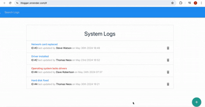
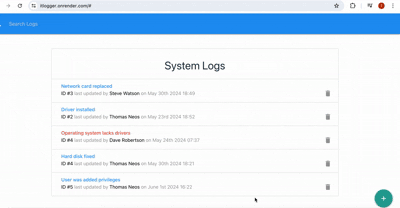

# Log Application

  

IT Department log application that gives users a modal form in order to add a system log or a new technician.
It also includes functionality for updating or deleting items from both lists in real time, and search bar for filtered data.
  

  
<!-- Badges -->

<h4>
    <a href="https://itlogger.onrender.com/">View Demo</a>
   · 
    <a href="https://github.com/SashenJayathilaka/Airbnb-Build/blob/master/README.md">Documentation</a>
   · 
    <a href="https://github.com/SashenJayathilaka/Airbnb-Build/issues">Report Bug</a>
   · 
    <a href="https://github.com/SashenJayathilaka/Airbnb-Build/issues">Request Feature</a>
  </h4>

 

<!-- About the Project -->

## :star2: About the Project

<!-- Screenshots -->

### :camera: Screenshots

- Main page, navigation bar, search bar and options for filtered data included

 

- New user functionality. App supports unique basket and wishlist for individual users.

## <a href="https://airbnb-sclone.vercel.app" target="_blank">LIVE DEMO 💥</a>

## Tech-stack

#### Client

- HTML
- CSS
- Materialize
- React
- Redux

#### Server

- Node.js
- Express
- Mongo.db

 

<table>
    <tr>
        <td>

        </td>
                <td>

        </td>
                        <td>

        </td>
                              <td>

        </td>
        <td>

        </td>
                        <td>

        </td>
                                <td>

        </td>
                                      <td>

        </td>
      
    </tr>
</table>

## :toolbox: Getting Started

### :bangbang: Prerequisites

- Install Node JS in your computer <a href='https://nodejs.org/en/'>HERE</a>

<!-- Env Variables -->

### :key: Environment Variables

To run this project, you will need to add the following environment variables to your .env file

`MODE`

`VITE_BACKEND`

`BASE_URL`

Open [http://localhost:3000](http://localhost:3000) with your browser to see the result.
